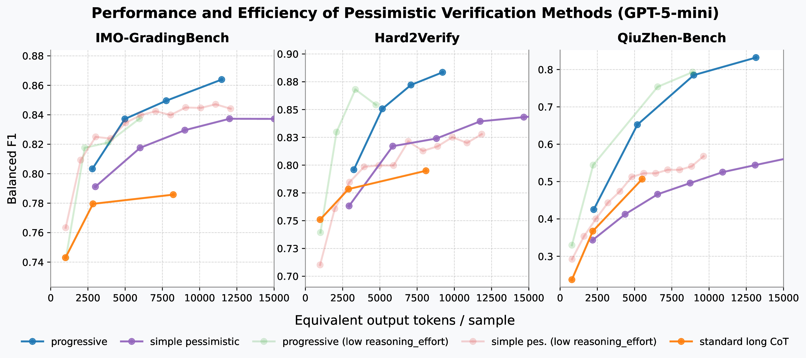
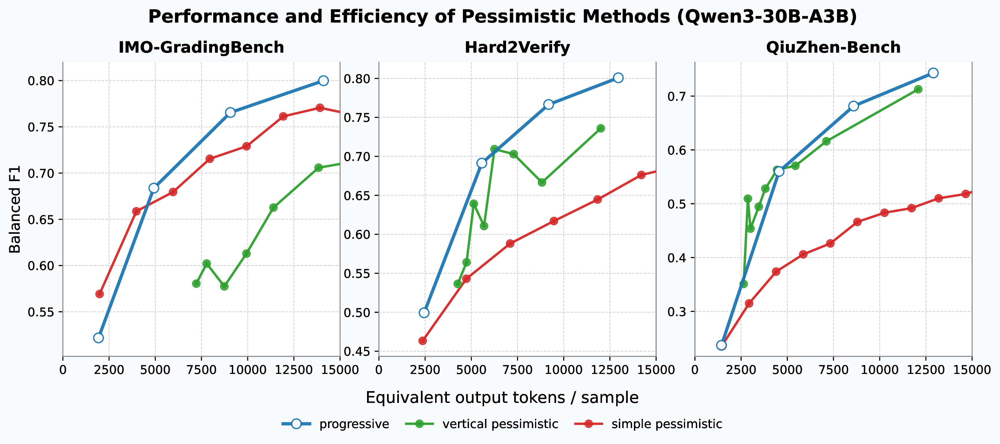

# pverify
Official codebase for the paper: Pessimistic Verification for Open Ended Math Questions

In pessimistic verification we construct multiple parallel verifications for the same proof, and the proof is deemed incorrect if any one of them reports an error. This simple technique significantly improves the performance across many math verification benchmarks without introducing too much extra budget. Its token efficiency even surpassed extended long-cot in test-time scaling.

This repository contains the official implementation of all three types of pverify methods and a complete baseline to reproduce all results in our paper. A full list of details of our case studies is also included under the folder `cases`. We also encourage the community to conduct more experiments on pessimistic verification in order to better determine its true performance.

## Usage

You can start using this repo with the following steps:

- Create an environment with Python 3.11 and install deps: `pip install -e .` (or `uv sync` if you use `uv`).
- Run the verifier with your model endpoints, choosing a reviewer style. Example (progressive verifier on QZ bench):  
  `python main.py --reviewer progressive --eval_dataset NP_dataset/qz_bench_eval.jsonl --proof_model gpt-5-mini --eval_model gpt-5 --prover_base_url <your_base_url> --prover_api_key <your_api_key>`
- To skip proof generation and only verify existing samples, pass `--verifier_samples <json_or_dataset>` (e.g., `Salesforce/Hard2Verify`, `NP_dataset/gradingbench.csv`).
- Log files (metrics, samples, and costs) are written to `eval_logs/<timestamp>/`; adjust with `--log_dir`.
- Ready-to-run command templates for our experiments live in `scripts/` (gradingbench, Hard2Verify, QZ bench).

Note that if you want to evaluate the results in QZ bench, you need to firstly run a proof and evaluation via a strong verifier. You need to first run `scripts/qz_bench_gpt_5_mini_gen.sh` and pass its logging directory as `verifier_samples` in `scripts/qz_bench_gpt_5_mini_eval.sh`.

**CLI Arguments**
- `--eval_dataset, -ed` (str, default `""`): dataset path or HF name for evaluation; see `NP_dataset/` presets and `Salesforce/Hard2Verify`.
- `--proof_model, -pm` (str, default `""`): model id used to generate proofs.
- `--eval_model, -em` (str, default `""`): model id used to judge proofs.
- `--log_dir` (str, default `eval_logs`): base directory where timestamped run folders are written.
- `--reasoning_effort` (str, default `medium`, choices `minimal|low|medium|high`): reasoning depth sent to supported models.
- `--reviewer` (str, default `standard`, choices `standard|pessimistic|vpessimistic|progressive|ppruning`): verification strategy.
- `--reviews` (int, default `3`): max reviews per sample for multi-review verifiers (`pessimistic`, `ppruning`).
- `--chunk_length` (int, default `7`): lines per chunk for `vpessimistic`.
- `--progressive_max_iters` (int, default `3`): refinement passes for `progressive`.
- `--progressive_min_chunk_size` (int, default `6`): minimum lines per chunk for `progressive`.
- `--prover_base_url` (str, default `""`): endpoint base URL for the prover model.
- `--eval_base_url` (str, default `""`): endpoint base URL for the evaluator (falls back to prover base URL when empty).
- `--prover_api_key` (str, default `""`): API key for the prover endpoint.
- `--eval_api_key` (str, default `""`): API key for the evaluator endpoint (falls back to prover key when empty).
- `--enable_thinking` / `--no-enable_thinking` (flag, default enabled): toggle provider-specific `enable_thinking` parameter.
- `--verifier_samples` (str, default `""`): path or dataset name for precomputed problems/proofs (skips new proof generation and uses stored ground-truth labels when available).
